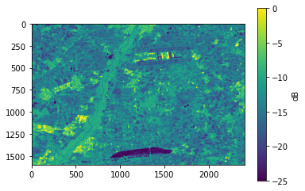

4. View processed data
----------------------

Load netcdf file with processed data

.. code:: ipython3

    import os
    from netCDF4 import Dataset
    import numpy as np
    
    my_example_nc_file = os.path.join(output_folder, 'data.nc')
    data = Dataset(my_example_nc_file, mode='r') 

View information about dataset

.. code:: ipython3

    data

.. code:: ipython3

    <class 'netCDF4._netCDF4.Dataset'>
    root group (NETCDF4 data model, file format HDF5):
        dimensions(sizes): lat(1603), lon(2404), time(1)
        variables(dimensions): float32 time(time), float32 orbitdirection(time), float32 relorbit(time), float32 satellite(time), float32 lat(lat), float32 lon(lon), float32 theta(time, lat, lon), float32 sigma0_vv_single(time, lat, lon), float32 sigma0_vh_single(time, lat, lon), float32 sigma0_vv_norm_single(time, lat, lon), float32 sigma0_vh_norm_single(time, lat, lon)
        groups: 

Read data from netcdf file

.. code:: ipython3

    data.variables['orbitdirection'][:]
    data.variables['time'][:]
    lons = data.variables['lon'][:]
    lats = data.variables['lat'][:]
    vv = data.variables['sigma0_vv_single'][:]
    
    vv_units = data.variables['sigma0_vv_single'].units

Close netcdf file

.. code:: ipython3

    data.close()

Plot vv polorized data

.. code:: ipython3

    %matplotlib inline
    from ipywidgets import interactive
    import matplotlib.pyplot as plt
    import numpy as np
    
    def f(x):
        # Problem: border pixel might be zero or negative
        # pixel eqal or smaller than zero are set to nan
        array = np.copy(vv[x])
        array[array <= 0] = np.nan
        # plot backscatter data in dB scale
        plt.imshow(10*np.log10(array))
        cbar = plt.colorbar()
        cbar.set_label('dB')
        plt.clim(-25, 0)
    
    interactive_plot = interactive(f, x=(0,len(vv)-1))
    interactive_plot

