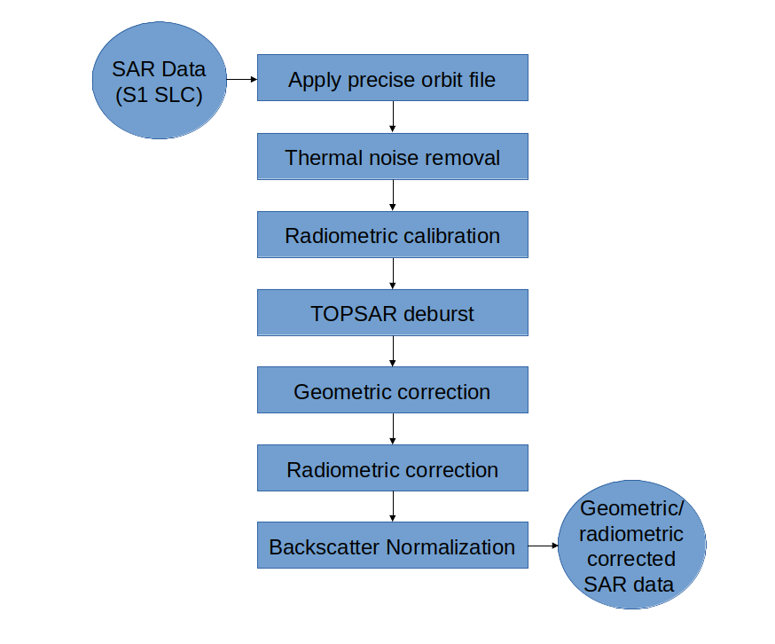

.. _ProcessingChain:

Default Pre-Processing Chain
============================

The default pre-processing chain was developed to process Sentinel-1 SLC data to provide geometric and radiometric corrected Sigma nought backscatter values. Among other things the processed data can be used within different radiative transfer models (e.g. Integration Equation Model :cite:`fung_backscattering_1992`, Oh Model :cite:`oh_empirical_1992`, :cite:`yisok_oh_quantitative_2004`, Dubois Model :cite:`dubois_measuring_1995`, Water Cloud Model :cite:`attema_vegetation_1978`, Single Scattering Radiative Transfer :cite:`ulaby_microwave_2014`, :cite:`weis_evaluation_2020`) to retrieve different land surface and/or vegetation parameters.

Overview
--------
The different preprocessing steps are shown in :numref:`work_flow_step_1` and :numref:`work_flow_step_2`. Additionally, every processing step is explained in more detail in the following subsections. As it can be seen in :numref:`work_flow_step_1` and :numref:`work_flow_step_2` the preprocessing work-flow is split in two main parts. The preprocessing methods in :numref:`work_flow_step_1` can be applied separately for every image. Whereas the work-flow shown in :numref:`work_flow_step_2` needs several images which were preprocessed by the different steps presented in :numref:`work_flow_step_1`.

.. _work_flow_step_1:

    Preprocessing chain showing processing steps to archive geometric and radiometric corrected Sentinel-1 data.

.. _work_flow_step_2:
.. figure:: images/work_flow_02.png
    :align: center
    :width: 80%

    Preprocessing chain showing processing steps to archive co-registered images which are multi-temporal speckle filtered

Sentinel-1 Level-1 SLC data
---------------------------
The preprocessing work-flow of :numref:`work_flow_step_1` is based on Sentinel-1 Level-1 SLC data. Among some other sources Sentinel-1 data can be downloaded from ESA's Copernicus Open Access Hub (`<https://scihub.copernicus.eu/>`_).

Sentinel-1 Level-1 SLC data are generated by the operational ESA Instrument Processing Facility (IPF). The SLC products are situated in slant range geometry. The slant range geometry is the natural radar one and is defined by the line-of-sight distance of the radar system to each reflecting object. The SLC product consists of focused SAR data in zero-Doppler orientation. Furthermore, for geo-referencing orbit and attitude information directly provided by the satellite are stored within the SLC product. Moreover the SAR data is corrected for errors caused by the well known azimuth bi-static delay, elevation antenna pattern and range spreading loss :cite:`sentinel-1_team_sentinel-1_2013`. In contrary to Level-1 Ground Range Detected (GRD) products SLC data preserve the real and imaginary part of the backscatter signal and contain therefore also the phase information :cite:`sentinel-1_team_sentinel-1_2013`. The IPF is generating SLC data for all available acquisition modes (StripMap (SM), Interferometric Wide (IW), Extra Wide (EW), and Wave (WV)) of the Sentinel-1 satellites. Further information about Sentinel-1 Level-1 products are gathered in ESA's Sentinel-1 User Handbook :cite:`sentinel-1_team_sentinel-1_2013` available at `<https://earth.esa.int/documents/247904/685163/Sentinel-1_User_Handbook>`_.

Precise orbit file
-------------------
Theory / Purpose
~~~~~~~~~~~~~~~~~~

During the acquisition of Sentinel-1 data the satellite position is recorded by a Global Navigation Satellite System (GNSS). To assure a fast delivery of Sentinel-1 products orbit information generated by an on-board navigation solution are stored within the Sentinel-1 Level-1 products. The orbit positions are later refined and made available as restituted or precise orbit files by the Copernicus Precise Orbit Determination (POD) Service. The POD products for Sentinel-1 data with given accuracy and availability after data acquisition are listed in :numref:`POD_table`.

.. _POD_table:
.. table:: Accuracy specification for Sentinel-1 POD products :cite:`sentinels_pod_team_sentinels_2016`
    :widths: auto

    +------------+--------------------------------------------+-------------+----------+
    |   Mission  | POD Product                                | Accuracy    | Latency  |
    +------------+--------------------------------------------+-------------+----------+
    |            | Restituted Orbit File                      | < 10 cm     | 3 hours  |
    |            +--------------------------------------------+-------------+----------+
    | Sentinel-1 | Precise Orbit Ephemerides (POE) Orbit file | < 5 cm      | 20 days  |
    |            +--------------------------------------------+-------------+----------+
    |            | Attitude Restituted Data                   | < 0.005 deg | 20 days  |
    +------------+--------------------------------------------+-------------+----------+

Precise orbit information can have a high influence on the quality of several preprocessing steps especially e.g. for the geo-referencing of the data. Therefore, it is always preferable to use the most accurate orbit information that is available.

Practical implementation
~~~~~~~~~~~~~~~~~~~~~~~~~
Since the preprocessing for the MULTIPLY project doesn't depend on near-real-time data the precise orbit file (available within 20 days) is used to update the orbit and velocity information within the Sentinel-1 SLC product. Therefore the operator "Apply Orbit Correction" of SNAP S1TBX toolbox is used.

Input:
    - Sentinel-1 SLC IW image (downloaded from Copernicus Open Access Hub)
    - Precise orbit file (automatic download by SNAP S1TBX)

Output:
    - Sentinel-1 SLC IW image with updated orbit information

Thermal noise removal
---------------------
Theory / Purpose
~~~~~~~~~~~~~~~~~~
Thermal noise is caused by the background energy of a SAR receiver and independent from the received signal power. Like some other noise factors thermal noise appears randomly over the entire image. But in contrary to quantization noise like speckle, which is connected to the signal power, thermal noise is hardly noticeable. Therefore, high impact of thermal noise on the quality of the data is especially given in areas like calm lakes, rivers and other with a low mean signal response detected by the SAR system. For the purpose of correction the IPF is calculating a thermal noise Look up Table (LUT) which is stored within the Sentinel-1 Level-1 product. More information about the calculation of the thermal noise for Sentinel-1 is given in :cite:`bourbigot_sentinel-1_2015`.

Practical implementation
~~~~~~~~~~~~~~~~~~~~~~~~~
The "Thermal Noise Removal" operator of SNAP S1TBX software is used to remove the thermal noise which is stored within a LUT within Sentinel-1 Level-1 products. Thermal noise removal can only applied on backscatter intensity therefore the phase information of the SLC data get lost.

Input:
    - Sentinel-1 SLC IW image with updated orbit information

Output:
    - Sentinel-1 SLC Intensity corrected by thermal noise

.. _radiometric_calibration:

Radiometric calibration
-------------------------
Theory / Purpose
~~~~~~~~~~~~~~~~~
Sentinel-1 Level-1 products are not radiometric corrected by default. However, for the quantitative use of SAR images a radiometric calibration of radar reflectivity (stored as Digital Numbers (DN) within Sentinel-1 Level-1 products) to physical units (radar backscatter) is essential. Otherwise a comparison of SAR images from different sensors or even the same sensor for different acquisition dates or different acquisition modes is not possible. To apply a radiometric calibration a Calibration Annotation Data Set (CADS) with four Look Up Tables (LUTs) are provided within the Sentinel-1 Level-1 products by Sentinel-1 Instrument Processing Facility (IPF). The four LUTs are used to convert DN to sigma naught, beta naught and gamma or vice versa. More information about the radiometric calibration is given in :cite:`miranda_radiometric_2015`.

Practical implementation
~~~~~~~~~~~~~~~~~~~~~~~~~
The "Radiometric Calibration" operator of SNAP S1TBX software is used to perform the conversion of DN to radar backscatter. In our case the output radar backscatter information is calibrated in Sigma naught.

Input:
    - Sentinel-1 SLC Intensity corrected by thermal noise

Output:
    - Sigma naught calibrated radar backscatter

TOPSAR Deburst
---------------
Theory / Purpose
~~~~~~~~~~~~~~~~~
Sentinel-1 Level-1 SLC images acquired in IW or EW swath mode consists of one image per swath and polarisation. IW products are made up of three swaths which means three images for single polarisation and six images for dual polarisation. EW products are made up of five swaths which means five images for single polarisation and ten images for dual polarisation. The sub-swath images consists of different bursts which are all processed as separate images. The different bursts are stored in one single image whereby each burst is separated by a black-filled demarcation :cite:`sentinel-1_team_sentinel-1_2013`. For the usage of Sentinel-1 Level-1 SLC data only one sub-swath can be extracted or several/all sub-swath can be combined to one image with fluent transitions between the sub-swaths. More detailed information are provided in :cite:`sentinel-1_team_sentinel-1_2013`, :cite:`daria_burst-mode_2007` and :cite:`de_zan_topsar_2006`.

Practical implementation
~~~~~~~~~~~~~~~~~~~~~~~~~
The "TOPSAR-Deburst" operator of SNAP S1TBX software is used to merge all sub-swath to retrieve one fluent image.

Input:
    - Sigma naught calibrated radar backscatter (with different sub-swath)

Output:
    - Sigma naught calibrated radar backscatter (with fluent transitions)

Geometric correction
---------------------
Theory / Purpose
~~~~~~~~~~~~~~~~~
An important part of the preprocessing chain is the geometric terrain correction. The geometric correction is a conversion of the Sentinel-1 SLC data from slant range geometry into a map coordinate system. Due to the acquisition geometry of the SAR different topographical distortions like foreshortening, layover or shadowing effects occur. The appropriate way to correct these distortions is the Range-Doppler approach. The method needs information about the topography (normally provided by a Digital Elevation Model (DEM)) as well as orbit and velocity information from the satellite (stored within Sentinel-1 SLC product) to correct the mentioned distortions and derive a precise geolocation for each pixel of the image.

Practical implementation
~~~~~~~~~~~~~~~~~~~~~~~~~
A geometric correction of the input data is performed by using the "Range Doppler Terrain Correction" method implement in SNAP's S1TBX software. Data from the Shuttle Radar Topography Mission (SRTM) with a resolution of 1-arc second (30 meters) is used for the necessary DEM.

Input:
    - Sigma naught calibrated radar backscatter (with fluent transitions)
    - SRTM data with 1-arc second resolution (automatic download by SNAP S1TBX)

Output:
    - Geometric corrected sigma naught calibrated radar backscatter (Map Projection WGS84)
    - Incidence angle from ellipsoid
    - Local incidence angle (based on SRTM)

Radiometric correction
---------------------------------------
Theory / Purpose
~~~~~~~~~~~~~~~~~
For the conversion of Sentinel-1 backscatter values to sigma or gamma naught, LUT's stored within the Sentinel-1 product are used (see :ref:`radiometric_calibration`). For the creation of the LUT's Sentinel-1 IPF is using an incidence angle of an ellipsoid inflated earth model :cite:`miranda_radiometric_2015`. Therefore, the local terrain variation within the image and their radiometric impact on the backscatter is considered insufficiently. A simple and widely used practice to consider the radiometric impact due to local terrain variations represents the approach to use the local incidence angle instead of the ellipsoid one :cite:`kellndorfer_toward_1998`. The radiometric corrected backscatter :math:`\sigma_{NORLIM}^{0}` used by kellndorfer_toward_1998 et al. :cite:`kellndorfer_toward_1998` can be calculated as

.. math::
    \sigma_{NORLIM}^{0} = \sigma_{Ell} \frac{sin \theta_{LIA}}{sin \theta_{Ell}}
    :label: kellndorfer_toward_1998

with :math:`\theta_{LIA}` as the local incidence angle, :math:`\theta_{Ell}` as the ellipsoid incidence angle used by IPF and the radar backscatter :math:`\sigma_{Ell}` calculated by using LUT's provided by IPF.

Practical implementation
~~~~~~~~~~~~~~~~~~~~~~~~~
Within the "Range Doppler Terrain Correction" method of SNAP's S1TBX software the radiometric normalisation approach of kellndorfer_toward_1998 et al. :cite:`kellndorfer_toward_1998` is implemented as a additional option. Unfortunately, the SNAP internal option can not be used with our kind of data. Therefore, normalisation after kellndorfer_toward_1998 et al :cite:`kellndorfer_toward_1998` is done by coding the equations within the "BandMath" operator of SNAP's S1TBX. The used local incidence angle is provided by the previous applied "Range Doppler Terrain Correction" and therefore the local incidence angle is based on the SRTM data.

Input:
    - Geometric corrected sigma naught calibrated radar backscatter (Map Projection WGS84)
    - Incidence angle from ellipsoid
    - Local incidence angle (based on SRTM)

Output:
    - Radiometric and geometric corrected sigma naught calibrated radar backscatter (Map Projection WGS84)

Backscatter normalisation
------------------------------------
Theory / Purpose
~~~~~~~~~~~~~~~~~
Beside the previously discussed geometric and radiometric distortions some other specific backscattering coefficient variations within the range direction of the image are caused by the image geometry of the SAR sensor. The backscattered energy of an illuminated area has not only a dependency on the area itself but also on the incidence angle. This means, backscatter values of a specific area with a small incidence angle return higher backscatter values then data of the same area acquired with a higher incidence angle. Incidence angle induced variations not only occur inside one image but also between images form different sensors as well as within one sensor through different acquisition geometries or different tracks or orbits. For a usage of Sentinel-1A and 1B time-series acquired with different orbits and/or different tracks and therefore most likly a high change between the incidence angles a backscatter normalisation is vital. A often and widely used technique to minimize backscatter variations caused by the incidence angle is the cosine correction :cite:`ulaby_microwave_1986`. The cosine correction is based on the Lambert's law for optics. Therefore, under the assumption that the backscattered energy in the upper hemisphere follows a cosine law and also the radiation variability has a cosine dependency, the received backscatter :math:`\sigma_{\theta_i}^{0}` and its dependency on the incidence angle can be written as

.. math::
    \sigma_{\theta_i}^{0} = \sigma_0^{0}cos^{n}(\theta_i)
    :label: cosine_1

with a weighting factor n and the incidence angle independent backscatter :math:`\sigma_{0}^{0}`.
With the cosine correction the backscatter of the Sentinel-1 products can therefore normalised to a reference angle :math:`\theta_{ref}` with

.. math::
    \sigma_{ref}^{0} = \frac{\sigma_{\theta_i}^{0}cos^{n}(\theta_{ref})}{cos^{n}_{\theta_i}}
    :label: cosine_2

Studies show that the weighting factor n is dependent on the roughness :cite:`ardila_angular_2010` and therefore the backscatter variations can vary with different land cover types. A schematic illustration of the backscatter variations considering the incidence angle is given in :numref:`wagner1999`.

.. _wagner1999:
.. figure:: images/wagner_1999.png
    :align: center
    :width: 60%

    Illustration of the backscatter variations considering the incidence angle dependency :cite:`wagner_study_1999`.

Practical implementation
~~~~~~~~~~~~~~~~~~~~~~~~~
The backscatter normlisation is applied by coding :eq:`cosine_2` in SNAP's S1TBX operator "BandMaths". As default a reference angle of 37,55° (average incidence angle for IW swath mode :cite:`bourbigot_sentinel-1_2015`) and a weighting factor of 2 (standard value) is specified. Through a configuration file the user can replace the default values for the reference angle and weighting factor to probably more suitable values of their specific applications.

Input:
    - Radiometric and geometric corrected sigma naught calibrated radar backscatter (Map Projection WGS84)
    - reference angle (default is 35°)
    - weighting factor (default is 2)

Output:
    - Radiometric and geometric corrected sigma naught calibrated radar backscatter values normalised to reference angle (Map Projection WGS84)

Co-registration
----------------
Theory / Purpose
~~~~~~~~~~~~~~~~~
For time-series analysis especially when applying a :ref:`multi_temporal_speckle_filter` the SAR image has to be co-registered. The co-registration is a method to get every image of the time-series on the same grid and also the pixel resolution.

Practical implementation
~~~~~~~~~~~~~~~~~~~~~~~~~
The co-registration as a requirement for the :ref:`multi_temporal_speckle_filter` is accomplished by the "Co-Registration" operator within SNAP's S1TBX. The "Co-Registration" operator in SNAP is defined as a completely automatic process. The operator consists of a stack creation (collocating master and slave image), a cross correlation (allignment between master ans slave image) and a warp (resamples pixels from the slave image to pixels of the master image).

Input:
    - Master image
    - Slave image(s)

Output:
    - Co-registered images

.. _multi_temporal_speckle_filter:

Multi-temporal speckle filter
-----------------------------
Theory / Purpose
~~~~~~~~~~~~~~~~~
A characteristic of images acquired by a SAR system is the visibility of random noise which look like "salt and pepper" within the image and is called speckle. The appearance of speckle is caused by the interferences of coherent echoes from individual scatterers within one pixel :cite:`woodhouse_introduction_2006`.The presence of speckle degrades the quality of the image and therefore it makes the interpretation of the SAR data more difficult. Over the years several approaches for speckle reduction were developed. They are mainly based on either multi-looking or filtering methods. Different filtering approaches like Frost, Lee etc. can be applied as a single or multi-temporal speckle filter. First findings with Sentinel-1 data show that a multi-temporal speckle filter provides better results in form of speckle reduction and resolution preservation then a single speckle filter. A major advantage for the usage of a multi-temporal speckle filter on Sentinel-1 data is the high temporal resolution availability. Nevertheless, more detailed studies on analysing the impact of different multi-temporal speckle filters on the retrieval of bio- and geophysical parameters from Sentinel-1 data are still lacking. Anyway, a usage of a multi-temporal filter significantly reduces the speckle and is therefore a essentinal part of our preprocessing chain.

Practical implementation
~~~~~~~~~~~~~~~~~~~~~~~~~
For the speckle reduction the "Multi-temporal Speckle Filter" operator within SNAP's S1TBX software is used. As default, 7 temporally consecutive images are used within the "Multi-temporal Speckle Filter" whereby the target image is temporally situated in the middle. The applied filter is a Lee filter with a spatial window size of 5x5 pixels, a sigma of 0.9, and a target window size of 3x3 pixels. The spatial averaging over pixel has a significant influence on spatial resolution information loss of the image. Therefore, the averaging pixel size might change during the project. If the image consists of two polarisations the filter is applied on each polarisation separately. The practical implementation in case of filter type, used polarisation, number of used images etc. may change with more experience of applying multi-temporal speckle filters and the occurring results.

Input:
    - x co-registered images (can be specified within configuration file)

Output:
    - speckle filtered images

Folder and data creation during pre-processing steps
----------------------------------------------------
Creation of
    - step1 (folder)
        - temporary results after applying processing steps shown in :numref:`work_flow_step_1`
    - step2 (folder)
        - co-registered images of step1
    - step3 (folder)
        - final results
    - foldername.nc (final netcdf stack file)
within specified output folder (config file)

Output layers of final netcdf stack file
-----------------------------------------
Output layer of default pre-processing chain
    - theta (local incidence angle)
    - sigma0_vv_single (single speckle filtered radiometric and geometric corrected sigma nought backscatter)
    - sigma0_vh_single (single speckle filtered radiometric and geometric corrected sigma nought backscatter)
    - sigma0_vv_multi (multi speckle filtered radiometric and geometric corrected sigma nought backscatter)
    - sigma0_vh_multi (multi speckle filtered radiometric and geometric corrected sigma nought backscatter)
    - sigma0_vv_norm_single (single speckle filtered radiometric and geometric corrected sigma nought backscatter normalized to a specific incidence angle)
    - sigma0_vh_norm_single (single speckle filtered radiometric and geometric corrected sigma nought backscatter normalized to a specific incidence angle)
    - sigma0_vv_norm_single (multi speckle filtered radiometric and geometric corrected sigma nought backscatter normalized to a specific incidence angle)
    - sigma0_vh_norm_single (multi speckle filtered radiometric and geometric corrected sigma nought backscatter normalized to a specific incidence angle)

Abbreviations and values within netcdf stack file
---------------------------------------------------------------------

Abbreviation within variable names
~~~~~~~~~~~~~~~~~~~~~~~~~~~~~~~~~~
    - theta = local incidence angle
    - sigma0 = radiometric and geometric corrected sigma nought backscatter
    - vv = VV polarization
    - vh = VH polarization
    - single = single speckle filter was applied
    - multi = multitemporal speckle filtered
    - norm = backscatter was normalized to a specific incidence angle

Values of specific variables
~~~~~~~~~~~~~~~~~~~~~~~~~~~~~~
- orbitdirection
    - 0 = Ascending
    - 1 = Descending

- relorbit
    - number of relative orbit

- satellite
    - 0 = Sentinel-1 A
    - 1 = Sentinel-1 B

- name tags of processed data
    - theta (local incidence angle)
    - sigma0 (radiometric and geometric corrected sigma nought backscatter)
    - vv (polarization vv)
    - vh (polarization vh)
    - single (single speckle filtered)
    - multi (multi temporal speckle filtered)
    - norm (backscatter normalized to a specific incidence angle)

.. rubric:: References
.. bibliography:: references.bib
    :style: unsrt

