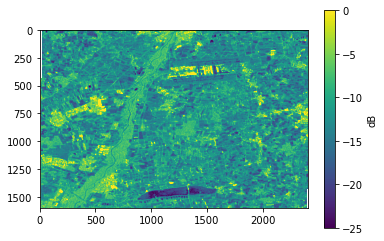

Example of running sar-pre-processing package
=============================================

1. Requirements
---------------

-  Installation of SenSARP
-  Installation of ESA’s SNAP Toolbox version >8.0.3

   -  Currently only SNAP version 8.0 can be downloaded from the ESA
      website (https://step.esa.int/main/download/snap-download/). To
      update SNAP to a version >8.0.3 please start the SNAP software.
      You will be asked if you want to search for update. After the
      updates are installed you need to restart SNAP to initialize the
      installed updates.
   -  SNAP Toolbox need libgfortran for specific operations but
      currently libgfortran is not installed during the installation
      process of SNAP therefore you might use
      ``sudo apt-get install gfortran``

-  Sentinel-1 SLC data

   -  Instruction how to download Sentinel 1 data are given in Section 2

2. Download sample data from Sentinel Data Hub
----------------------------------------------

Option 1: Download data from Sentinel Data Hub via python package sentinelsat
~~~~~~~~~~~~~~~~~~~~~~~~~~~~~~~~~~~~~~~~~~~~~~~~~~~~~~~~~~~~~~~~~~~~~~~~~~~~~

Create Account (https://scihub.copernicus.eu/dhus/#/self-registration)
and change user and password below.

.. code:: ipython3

    # connect to the API
    from sentinelsat import SentinelAPI, read_geojson, geojson_to_wkt
    from datetime import date
    user = 'mcwhity'
    password = 'dS1dfSSDHasap'
    # initialize settings
    api = SentinelAPI(user, password)

Search for available data

.. code:: ipython3

    # search by polygon (MNI test site coordinates), time, and SciHub query keywords
    footprint = geojson_to_wkt(read_geojson('coordinates_mni.geojson'))
    products = api.query(footprint,
                         date=('20210601', '20210610'),
                         platformname='Sentinel-1',
                         producttype='SLC')
    print('Following products will be downloaded')
    print(api.to_dataframe(products).title.values)
    
    print('These {} product need {} Gb of disk space'.format(len(products), api.get_products_size(products)))

.. parsed-literal::

    Following products will be downloaded
    ['S1A_IW_SLC__1SDV_20210609T165916_20210609T165943_038266_0483FE_CD3F'
     'S1A_IW_SLC__1SDV_20210609T165941_20210609T170008_038266_0483FE_08A0'
     'S1B_IW_SLC__1SDV_20210607T051737_20210607T051804_027246_034125_2C2A'
     'S1A_IW_SLC__1SDV_20210606T052628_20210606T052655_038215_04828D_89C3'
     'S1B_IW_SLC__1SDV_20210603T165832_20210603T165900_027195_033F94_5E37'
     'S1B_IW_SLC__1SDV_20210603T165857_20210603T165924_027195_033F94_E158'
     'S1A_IW_SLC__1SDV_20210602T170732_20210602T170759_038164_048116_EF11'
     'S1A_IW_SLC__1SDV_20210601T051818_20210601T051846_038142_048071_F417']
    These 8 product need 62.38 Gb of disk space

Start download process (**Attention: might take a while and data will
requries some free disk space)**

.. code:: ipython3

    # download all results from the search
    # files will be downloaded to specified path
    import os
    path = os.path.expanduser('~/Desktop/data')
    try:
        os.makedirs(path)
    except: FileExistsError
    api.download_all(products, path)

.. parsed-literal::

    Downloading products:   0%|          | 0/8 [00:00<?, ?product/s]

.. parsed-literal::

    ResultTuple(downloaded={'82b56bfe-ae81-400d-9566-856ea5708c82': {'id': '82b56bfe-ae81-400d-9566-856ea5708c82', 'title': 'S1B_IW_SLC__1SDV_20210603T165832_20210603T165900_027195_033F94_5E37', 'size': 4659369500, 'md5': '97dd02b7000b81518241dce5291ad416', 'date': datetime.datetime(2021, 6, 3, 16, 58, 32, 151000), 'footprint': 'POLYGON((11.138996 48.198143,14.610800 48.601761,14.991888 46.929924,11.631874 46.527458,11.138996 48.198143))', 'url': "https://apihub.copernicus.eu/apihub/odata/v1/Products('82b56bfe-ae81-400d-9566-856ea5708c82')/$value", 'Online': True, 'Creation Date': datetime.datetime(2021, 6, 3, 19, 55, 20, 896000), 'Ingestion Date': datetime.datetime(2021, 6, 3, 19, 39, 53, 909000), 'quicklook_url': "https://apihub.copernicus.eu/apihub/odata/v1/Products('82b56bfe-ae81-400d-9566-856ea5708c82')/Products('Quicklook')/$value", 'path': '/home/test/Desktop/data/S1B_IW_SLC__1SDV_20210603T165832_20210603T165900_027195_033F94_5E37.zip', 'downloaded_bytes': 0}, '11d586f4-3586-43e4-8bf6-4ad13dc2b890': {'id': '11d586f4-3586-43e4-8bf6-4ad13dc2b890', 'title': 'S1A_IW_SLC__1SDV_20210602T170732_20210602T170759_038164_048116_EF11', 'size': 4506728259, 'md5': '30f4783969b3abc389919af7d48dafd0', 'date': datetime.datetime(2021, 6, 2, 17, 7, 32, 878000), 'footprint': 'POLYGON((9.013099 48.466660,12.482429 48.868031,12.852770 47.252243,9.492514 46.852081,9.013099 48.466660))', 'url': "https://apihub.copernicus.eu/apihub/odata/v1/Products('11d586f4-3586-43e4-8bf6-4ad13dc2b890')/$value", 'Online': True, 'Creation Date': datetime.datetime(2021, 6, 2, 19, 16, 2, 627000), 'Ingestion Date': datetime.datetime(2021, 6, 2, 19, 13, 0, 207000), 'quicklook_url': "https://apihub.copernicus.eu/apihub/odata/v1/Products('11d586f4-3586-43e4-8bf6-4ad13dc2b890')/Products('Quicklook')/$value", 'path': '/home/test/Desktop/data/S1A_IW_SLC__1SDV_20210602T170732_20210602T170759_038164_048116_EF11.zip', 'downloaded_bytes': 0}, '289f813e-e1b4-45fe-9172-1af678bac9eb': {'id': '289f813e-e1b4-45fe-9172-1af678bac9eb', 'title': 'S1B_IW_SLC__1SDV_20210607T051737_20210607T051804_027246_034125_2C2A', 'size': 4579692094, 'md5': '7f3ab24aabb36a8bbc0872318292506e', 'date': datetime.datetime(2021, 6, 7, 5, 17, 37, 395000), 'footprint': 'POLYGON((14.730282 47.650463,11.294503 48.053986,11.671267 49.676785,15.222157 49.271729,14.730282 47.650463))', 'url': "https://apihub.copernicus.eu/apihub/odata/v1/Products('289f813e-e1b4-45fe-9172-1af678bac9eb')/$value", 'Online': True, 'Creation Date': datetime.datetime(2021, 6, 7, 7, 58, 5, 98000), 'Ingestion Date': datetime.datetime(2021, 6, 7, 7, 55, 18, 573000), 'quicklook_url': "https://apihub.copernicus.eu/apihub/odata/v1/Products('289f813e-e1b4-45fe-9172-1af678bac9eb')/Products('Quicklook')/$value", 'path': '/home/test/Desktop/data/S1B_IW_SLC__1SDV_20210607T051737_20210607T051804_027246_034125_2C2A.zip', 'downloaded_bytes': 0}, '981b798e-bcf8-48fa-acd0-4c859cf336b4': {'id': '981b798e-bcf8-48fa-acd0-4c859cf336b4', 'title': 'S1A_IW_SLC__1SDV_20210601T051818_20210601T051846_038142_048071_F417', 'size': 4643623329, 'md5': '228ed352b1411fcfc39ee6d79a2887c6', 'date': datetime.datetime(2021, 6, 1, 5, 18, 18, 742000), 'footprint': 'POLYGON((14.704199 47.602592,11.278880 48.004967,11.666771 49.677139,15.210303 49.273212,14.704199 47.602592))', 'url': "https://apihub.copernicus.eu/apihub/odata/v1/Products('981b798e-bcf8-48fa-acd0-4c859cf336b4')/$value", 'Online': True, 'Creation Date': datetime.datetime(2021, 6, 1, 8, 34, 0, 989000), 'Ingestion Date': datetime.datetime(2021, 6, 1, 8, 27, 59, 416000), 'quicklook_url': "https://apihub.copernicus.eu/apihub/odata/v1/Products('981b798e-bcf8-48fa-acd0-4c859cf336b4')/Products('Quicklook')/$value", 'path': '/home/test/Desktop/data/S1A_IW_SLC__1SDV_20210601T051818_20210601T051846_038142_048071_F417.zip', 'downloaded_bytes': 0}, '831ddc00-03f9-4ee8-b580-f020ad407d82': {'id': '831ddc00-03f9-4ee8-b580-f020ad407d82', 'title': 'S1A_IW_SLC__1SDV_20210609T165916_20210609T165943_038266_0483FE_CD3F', 'size': 4548989347, 'md5': 'e3dd771f60e8390709efa506872a7b95', 'date': datetime.datetime(2021, 6, 9, 16, 59, 16, 196000), 'footprint': 'POLYGON((11.143135 48.258904,14.600786 48.660034,14.969513 47.044025,11.619840 46.644009,11.143135 48.258904))', 'url': "https://apihub.copernicus.eu/apihub/odata/v1/Products('831ddc00-03f9-4ee8-b580-f020ad407d82')/$value", 'Online': True, 'Creation Date': datetime.datetime(2021, 6, 9, 19, 31, 2, 279000), 'Ingestion Date': datetime.datetime(2021, 6, 9, 19, 27, 42, 651000), 'quicklook_url': "https://apihub.copernicus.eu/apihub/odata/v1/Products('831ddc00-03f9-4ee8-b580-f020ad407d82')/Products('Quicklook')/$value", 'path': '/home/test/Desktop/data/S1A_IW_SLC__1SDV_20210609T165916_20210609T165943_038266_0483FE_CD3F.zip', 'downloaded_bytes': 0}, '64927dda-237b-4bb0-904d-162b7a70a2e3': {'id': '64927dda-237b-4bb0-904d-162b7a70a2e3', 'title': 'S1A_IW_SLC__1SDV_20210606T052628_20210606T052655_038215_04828D_89C3', 'size': 4768927313, 'md5': '15306c55caf66927bafc628ee67bc117', 'date': datetime.datetime(2021, 6, 6, 5, 26, 28, 9000), 'footprint': 'POLYGON((12.719548 47.890720,9.287097 48.291676,9.676860 49.963684,13.228923 49.561081,12.719548 47.890720))', 'url': "https://apihub.copernicus.eu/apihub/odata/v1/Products('64927dda-237b-4bb0-904d-162b7a70a2e3')/$value", 'Online': True, 'Creation Date': datetime.datetime(2021, 6, 6, 7, 54, 1, 149000), 'Ingestion Date': datetime.datetime(2021, 6, 6, 7, 40, 12, 636000), 'quicklook_url': "https://apihub.copernicus.eu/apihub/odata/v1/Products('64927dda-237b-4bb0-904d-162b7a70a2e3')/Products('Quicklook')/$value", 'path': '/home/test/Desktop/data/S1A_IW_SLC__1SDV_20210606T052628_20210606T052655_038215_04828D_89C3.zip', 'downloaded_bytes': 0}, '7b184dde-398a-413d-b831-c7cec0e5e280': {'id': '7b184dde-398a-413d-b831-c7cec0e5e280', 'title': 'S1B_IW_SLC__1SDV_20210603T165857_20210603T165924_027195_033F94_E158', 'size': 4514118912, 'md5': 'fe0695fa9ab0031bd5d088c3d0f80f23', 'date': datetime.datetime(2021, 6, 3, 16, 58, 57, 919000), 'footprint': 'POLYGON((10.673225 49.681793,14.257388 50.087708,14.634924 48.473183,11.167990 48.068962,10.673225 49.681793))', 'url': "https://apihub.copernicus.eu/apihub/odata/v1/Products('7b184dde-398a-413d-b831-c7cec0e5e280')/$value", 'Online': True, 'Creation Date': datetime.datetime(2021, 6, 3, 19, 10, 0, 642000), 'Ingestion Date': datetime.datetime(2021, 6, 3, 19, 6, 43, 336000), 'quicklook_url': "https://apihub.copernicus.eu/apihub/odata/v1/Products('7b184dde-398a-413d-b831-c7cec0e5e280')/Products('Quicklook')/$value", 'path': '/home/test/Desktop/data/S1B_IW_SLC__1SDV_20210603T165857_20210603T165924_027195_033F94_E158.zip', 'downloaded_bytes': 0}, 'e00dc515-5eff-4ea8-96c8-d5caf6aeee07': {'id': 'e00dc515-5eff-4ea8-96c8-d5caf6aeee07', 'title': 'S1A_IW_SLC__1SDV_20210609T165941_20210609T170008_038266_0483FE_08A0', 'size': 4745810602, 'md5': 'd4d9942102fe81625103c2e142e01643', 'date': datetime.datetime(2021, 6, 9, 16, 59, 41, 19000), 'footprint': 'POLYGON((10.659264 49.800045,14.233418 50.203533,14.625066 48.530590,11.172318 48.128857,10.659264 49.800045))', 'url': "https://apihub.copernicus.eu/apihub/odata/v1/Products('e00dc515-5eff-4ea8-96c8-d5caf6aeee07')/$value", 'Online': True, 'Creation Date': datetime.datetime(2021, 6, 9, 19, 9, 1, 974000), 'Ingestion Date': datetime.datetime(2021, 6, 9, 19, 4, 27, 477000), 'quicklook_url': "https://apihub.copernicus.eu/apihub/odata/v1/Products('e00dc515-5eff-4ea8-96c8-d5caf6aeee07')/Products('Quicklook')/$value", 'path': '/home/test/Desktop/data/S1A_IW_SLC__1SDV_20210609T165941_20210609T170008_038266_0483FE_08A0.zip', 'downloaded_bytes': 0}}, retrieval_triggered={}, failed={})

Option 2: Manually search and download data from Alaska Satellite Facility (ASF)
~~~~~~~~~~~~~~~~~~~~~~~~~~~~~~~~~~~~~~~~~~~~~~~~~~~~~~~~~~~~~~~~~~~~~~~~~~~~~~~~

You can search for Sentinel-1 data at https://search.asf.alaska.edu/. A
NASA EOSDIS Earthdata Login account is required for downloading data and
tools from ASF. Registering for an Earthdata Login account is free
(https://urs.earthdata.nasa.gov/home). Instructions how to download data
from ASF can be found at
https://asf.alaska.edu/wp-content/uploads/2019/02/asf_datarecipe_bulk_download_from_vertex_python_script_v1.pdf.

3. Use sar-pre-processing package to process Sentinel-1 SLC data
----------------------------------------------------------------

Set paths for - input_folder (path to stored Sentinel-1 SLC data (zip
files) e.g. “~/Downloads”) - output_folder (path where processed data
will be stored e.g. “~/output”) - gpt_loction (gpt is located in the bin
folder of your SNAP installation)’

.. code:: ipython3

    input_folder = path
    output_folder = path
    gpt_location = os.path.expanduser('~/snap/bin/gpt')

Create config file with information about input, output and gpt location

.. code:: ipython3

    import yaml
    
    with open('sample_config_file.yaml') as stream:
       data = yaml.safe_load(stream)
    
    data['input_folder'] = input_folder
    data['output_folder'] = output_folder
    data['gpt'] = gpt_location
    
    with open('test_config_file.yaml', 'wb') as stream:
       yaml.safe_dump(data, stream, default_flow_style=False, 
                      explicit_start=True, allow_unicode=True, encoding='utf-8')

Optional config options which might be useful

.. code:: ipython3

    with open('test_config_file.yaml') as stream:
       data = yaml.safe_load(stream)
    
    # Filter option
    ## Filter via year of interes
    data['year'] = '2021'
    
    ## Define region of interest
    data['region']['lr']['lat'] = 48.2 # lower right latitude
    data['region']['lr']['lon'] = 11.9 # lower right longitude
    data['region']['ul']['lat'] = 48.4 # upper left latitude
    data['region']['ul']['lon'] = 11.6 # upper left longitude
    data['region']['subset'] = 'yes'
    
    ## Define multi-temporal filtering properties
    data['speckle_filter']['multi_temporal']['apply'] = 'yes'
    data['speckle_filter']['multi_temporal']['files'] = '5' # Number of files used for multi temporal filtering
    
    ## Define incidence angle for normalization
    data['normalization_angle'] = '35'
    
    with open('test_config_file.yaml', 'wb') as stream:
       yaml.safe_dump(data, stream, default_flow_style=False, 
                      explicit_start=True, allow_unicode=True, encoding='utf-8')

Start pre-processing steps

.. code:: ipython3

    from sar_pre_processing.sar_pre_processor import *
    import warnings
    warnings.filterwarnings("ignore")
    
    processing = SARPreProcessor(config='test_config_file.yaml')
    processing.create_processing_file_list()
    print('start step 1')
    processing.pre_process_step1()
    print('start step 2')
    processing.pre_process_step2()
    print('start step 3')
    processing.pre_process_step3()
    print('start add netcdf information')
    processing.add_netcdf_information()
    print('start create netcdf stack')
    processing.create_netcdf_stack()

.. parsed-literal::

    INFO:root:Found files within input folder: 8
    INFO:root:Number of found files for year 2021: 8
    INFO:root:area of interest not specified
    INFO:root:Number of found files that were double processed: 0.0
    INFO:root:Number of found files with border issues: 4
    INFO:root:area of interest specified
    INFO:root:normalisation angle not specified, default value of 35 is used for processing
    INFO:ComponentProgress:0
    INFO:ComponentProgress:0
    INFO:root:Process S1A_IW_SLC__1SDV_20210601T051818_20210601T051846_038142_048071_F417.zip with SNAP.

.. parsed-literal::

    start step 1

.. parsed-literal::

    INFO: org.esa.snap.core.gpf.operators.tooladapter.ToolAdapterIO: Initializing external tool adapters
    INFO: org.esa.s2tbx.dataio.gdal.GDALVersion: Incompatible GDAL 3.3.1 found on system. Internal GDAL 3.0.0 from distribution will be used.
    INFO: org.esa.s2tbx.dataio.gdal.GDALVersion: Internal GDAL 3.0.0 set to be used by SNAP.
    INFO: org.esa.snap.core.util.EngineVersionCheckActivator: Please check regularly for new updates for the best SNAP experience.
    INFO: org.esa.s2tbx.dataio.gdal.GDALVersion: Internal GDAL 3.0.0 set to be used by SNAP.

.. parsed-literal::

    Executing processing graph

.. parsed-literal::

    INFO: org.hsqldb.persist.Logger: dataFileCache open start
    WARNING: org.esa.s1tbx.sar.gpf.orbits.ApplyOrbitFileOp: No valid orbit file found for 01-JUN-2021 05:17:11.000000
    Orbit files may be downloaded from https://scihub.copernicus.eu/gnss/odata/v1/
    and placed in /home/test/.snap/auxdata/Orbits/Sentinel-1/POEORB/S1A/2021/06

.. parsed-literal::

    OpenSearch: https://scihub.copernicus.eu/gnss/search?q=platformname:Sentinel-1 AND platformnumber:A AND producttype:AUX_RESORB AND beginposition:[2021-06-01T00:00:000Z TO 2021-06-31T24:00:000Z]
    OpenSearch: 0 total results on 1 pages.
    OpenSearch: https://scihub.copernicus.eu/gnss/search?q=platformname:Sentinel-1 AND platformnumber:A AND producttype:AUX_RESORB AND beginposition:[2021-05-01T00:00:000Z TO 2021-05-31T24:00:000Z]
    OpenSearch: 0 total results on 1 pages.

.. parsed-literal::

    WARNING: org.esa.s1tbx.sar.gpf.orbits.ApplyOrbitFileOp: ApplyOrbit ignoring error and continuing: java.io.IOException: No valid orbit file found for 01-JUN-2021 05:17:11.000000
    Orbit files may be downloaded from https://scihub.copernicus.eu/gnss/odata/v1/
    and placed in /home/test/.snap/auxdata/Orbits/Sentinel-1/POEORB/S1A/2021/06

.. parsed-literal::

    ...12%...24%..34%...46%...58%..68%...80%... done.

.. parsed-literal::

    INFO:root:0
    INFO:ComponentProgress:12
    INFO:ComponentProgress:12
    INFO:root:Process S1A_IW_SLC__1SDV_20210602T170732_20210602T170759_038164_048116_EF11.zip with SNAP.
    INFO: org.esa.snap.core.gpf.operators.tooladapter.ToolAdapterIO: Initializing external tool adapters
    INFO: org.esa.s2tbx.dataio.gdal.GDALVersion: Incompatible GDAL 3.3.1 found on system. Internal GDAL 3.0.0 from distribution will be used.
    INFO: org.esa.s2tbx.dataio.gdal.GDALVersion: Internal GDAL 3.0.0 set to be used by SNAP.
    INFO: org.esa.snap.core.util.EngineVersionCheckActivator: Please check regularly for new updates for the best SNAP experience.
    INFO: org.esa.s2tbx.dataio.gdal.GDALVersion: Internal GDAL 3.0.0 set to be used by SNAP.

.. parsed-literal::

    Executing processing graph

.. parsed-literal::

    INFO: org.hsqldb.persist.Logger: dataFileCache open start
    WARNING: org.esa.s1tbx.sar.gpf.orbits.ApplyOrbitFileOp: No valid orbit file found for 02-JUN-2021 17:06:25.000000
    Orbit files may be downloaded from https://scihub.copernicus.eu/gnss/odata/v1/
    and placed in /home/test/.snap/auxdata/Orbits/Sentinel-1/POEORB/S1A/2021/06

.. parsed-literal::

    OpenSearch: https://scihub.copernicus.eu/gnss/search?q=platformname:Sentinel-1 AND platformnumber:A AND producttype:AUX_RESORB AND beginposition:[2021-06-01T00:00:000Z TO 2021-06-31T24:00:000Z]
    OpenSearch: 0 total results on 1 pages.
    OpenSearch: https://scihub.copernicus.eu/gnss/search?q=platformname:Sentinel-1 AND platformnumber:A AND producttype:AUX_RESORB AND beginposition:[2021-05-01T00:00:000Z TO 2021-05-31T24:00:000Z]
    OpenSearch: 0 total results on 1 pages.

.. parsed-literal::

    WARNING: org.esa.s1tbx.sar.gpf.orbits.ApplyOrbitFileOp: ApplyOrbit ignoring error and continuing: java.io.IOException: No valid orbit file found for 02-JUN-2021 17:06:25.000000
    Orbit files may be downloaded from https://scihub.copernicus.eu/gnss/odata/v1/
    and placed in /home/test/.snap/auxdata/Orbits/Sentinel-1/POEORB/S1A/2021/06

.. parsed-literal::

    ...11%...21%...32%...43%...53%...64%...75%...85%.. done.

.. parsed-literal::

    INFO:root:0
    INFO:ComponentProgress:25
    INFO:ComponentProgress:25
    INFO:root:Process S1A_IW_SLC__1SDV_20210606T052628_20210606T052655_038215_04828D_89C3.zip with SNAP.
    INFO: org.esa.snap.core.gpf.operators.tooladapter.ToolAdapterIO: Initializing external tool adapters
    INFO: org.esa.s2tbx.dataio.gdal.GDALVersion: Incompatible GDAL 3.3.1 found on system. Internal GDAL 3.0.0 from distribution will be used.
    INFO: org.esa.s2tbx.dataio.gdal.GDALVersion: Internal GDAL 3.0.0 set to be used by SNAP.
    INFO: org.esa.snap.core.util.EngineVersionCheckActivator: Please check regularly for new updates for the best SNAP experience.
    INFO: org.esa.s2tbx.dataio.gdal.GDALVersion: Internal GDAL 3.0.0 set to be used by SNAP.

.. parsed-literal::

    Executing processing graph

.. parsed-literal::

    INFO: org.hsqldb.persist.Logger: dataFileCache open start
    WARNING: org.esa.s1tbx.sar.gpf.orbits.ApplyOrbitFileOp: No valid orbit file found for 06-JUN-2021 05:25:20.000000
    Orbit files may be downloaded from https://scihub.copernicus.eu/gnss/odata/v1/
    and placed in /home/test/.snap/auxdata/Orbits/Sentinel-1/POEORB/S1A/2021/06

.. parsed-literal::

    OpenSearch: https://scihub.copernicus.eu/gnss/search?q=platformname:Sentinel-1 AND platformnumber:A AND producttype:AUX_RESORB AND beginposition:[2021-06-01T00:00:000Z TO 2021-06-31T24:00:000Z]
    OpenSearch: 0 total results on 1 pages.
    OpenSearch: https://scihub.copernicus.eu/gnss/search?q=platformname:Sentinel-1 AND platformnumber:A AND producttype:AUX_RESORB AND beginposition:[2021-05-01T00:00:000Z TO 2021-05-31T24:00:000Z]
    OpenSearch: 0 total results on 1 pages.

.. parsed-literal::

    WARNING: org.esa.s1tbx.sar.gpf.orbits.ApplyOrbitFileOp: ApplyOrbit ignoring error and continuing: java.io.IOException: No valid orbit file found for 06-JUN-2021 05:25:20.000000
    Orbit files may be downloaded from https://scihub.copernicus.eu/gnss/odata/v1/
    and placed in /home/test/.snap/auxdata/Orbits/Sentinel-1/POEORB/S1A/2021/06

.. parsed-literal::

    ...10%...21%...31%...42%...52%...63%...74%...84%.. done.

.. parsed-literal::

    INFO:root:0
    INFO:ComponentProgress:37
    INFO:ComponentProgress:37
    INFO:root:Process S1B_IW_SLC__1SDV_20210607T051737_20210607T051804_027246_034125_2C2A.zip with SNAP.
    INFO: org.esa.snap.core.gpf.operators.tooladapter.ToolAdapterIO: Initializing external tool adapters
    INFO: org.esa.s2tbx.dataio.gdal.GDALVersion: Incompatible GDAL 3.3.1 found on system. Internal GDAL 3.0.0 from distribution will be used.
    INFO: org.esa.s2tbx.dataio.gdal.GDALVersion: Internal GDAL 3.0.0 set to be used by SNAP.
    INFO: org.esa.snap.core.util.EngineVersionCheckActivator: Please check regularly for new updates for the best SNAP experience.
    INFO: org.esa.s2tbx.dataio.gdal.GDALVersion: Internal GDAL 3.0.0 set to be used by SNAP.

.. parsed-literal::

    Executing processing graph

.. parsed-literal::

    INFO: org.hsqldb.persist.Logger: dataFileCache open start
    WARNING: org.esa.s1tbx.sar.gpf.orbits.ApplyOrbitFileOp: No valid orbit file found for 07-JUN-2021 05:16:29.000000
    Orbit files may be downloaded from https://scihub.copernicus.eu/gnss/odata/v1/
    and placed in /home/test/.snap/auxdata/Orbits/Sentinel-1/POEORB/S1B/2021/06

.. parsed-literal::

    OpenSearch: https://scihub.copernicus.eu/gnss/search?q=platformname:Sentinel-1 AND platformnumber:B AND producttype:AUX_RESORB AND beginposition:[2021-06-01T00:00:000Z TO 2021-06-31T24:00:000Z]
    OpenSearch: 0 total results on 1 pages.
    OpenSearch: https://scihub.copernicus.eu/gnss/search?q=platformname:Sentinel-1 AND platformnumber:B AND producttype:AUX_RESORB AND beginposition:[2021-05-01T00:00:000Z TO 2021-05-31T24:00:000Z]
    OpenSearch: 0 total results on 1 pages.

.. parsed-literal::

    WARNING: org.esa.s1tbx.sar.gpf.orbits.ApplyOrbitFileOp: ApplyOrbit ignoring error and continuing: java.io.IOException: No valid orbit file found for 07-JUN-2021 05:16:29.000000
    Orbit files may be downloaded from https://scihub.copernicus.eu/gnss/odata/v1/
    and placed in /home/test/.snap/auxdata/Orbits/Sentinel-1/POEORB/S1B/2021/06

.. parsed-literal::

    ...12%...24%..34%...46%...58%..68%...80%... done.

.. parsed-literal::

    INFO:root:0
    INFO:ComponentProgress:50
    INFO:ComponentProgress:50
    INFO:root:Process S1A_IW_SLC__1SDV_20210609T165916_20210609T165943_038266_0483FE_CD3F.zip with SNAP.
    INFO: org.esa.snap.core.gpf.operators.tooladapter.ToolAdapterIO: Initializing external tool adapters
    INFO: org.esa.s2tbx.dataio.gdal.GDALVersion: Incompatible GDAL 3.3.1 found on system. Internal GDAL 3.0.0 from distribution will be used.
    INFO: org.esa.s2tbx.dataio.gdal.GDALVersion: Internal GDAL 3.0.0 set to be used by SNAP.
    INFO: org.esa.snap.core.util.EngineVersionCheckActivator: Please check regularly for new updates for the best SNAP experience.
    INFO: org.esa.s2tbx.dataio.gdal.GDALVersion: Internal GDAL 3.0.0 set to be used by SNAP.

.. parsed-literal::

    Executing processing graph

.. parsed-literal::

    INFO: org.hsqldb.persist.Logger: dataFileCache open start
    WARNING: org.esa.s1tbx.sar.gpf.orbits.ApplyOrbitFileOp: No valid orbit file found for 09-JUN-2021 16:58:08.000000
    Orbit files may be downloaded from https://scihub.copernicus.eu/gnss/odata/v1/
    and placed in /home/test/.snap/auxdata/Orbits/Sentinel-1/POEORB/S1A/2021/06

.. parsed-literal::

    OpenSearch: https://scihub.copernicus.eu/gnss/search?q=platformname:Sentinel-1 AND platformnumber:A AND producttype:AUX_RESORB AND beginposition:[2021-06-01T00:00:000Z TO 2021-06-31T24:00:000Z]
    OpenSearch: 0 total results on 1 pages.
    OpenSearch: https://scihub.copernicus.eu/gnss/search?q=platformname:Sentinel-1 AND platformnumber:A AND producttype:AUX_RESORB AND beginposition:[2021-05-01T00:00:000Z TO 2021-05-31T24:00:000Z]
    OpenSearch: 0 total results on 1 pages.

.. parsed-literal::

    WARNING: org.esa.s1tbx.sar.gpf.orbits.ApplyOrbitFileOp: ApplyOrbit ignoring error and continuing: java.io.IOException: No valid orbit file found for 09-JUN-2021 16:58:08.000000
    Orbit files may be downloaded from https://scihub.copernicus.eu/gnss/odata/v1/
    and placed in /home/test/.snap/auxdata/Orbits/Sentinel-1/POEORB/S1A/2021/06

.. parsed-literal::

    ...10%...20%...30%....42%...52%...62%...72%...82%... done.

.. parsed-literal::

    INFO:root:0
    INFO:ComponentProgress:62
    INFO:ComponentProgress:62
    INFO:root:Process S1B_IW_SLC__1SDV_20210603T165832_20210603T165900_027195_033F94_5E37.zip with SNAP.
    INFO: org.esa.snap.core.gpf.operators.tooladapter.ToolAdapterIO: Initializing external tool adapters
    INFO: org.esa.s2tbx.dataio.gdal.GDALVersion: Incompatible GDAL 3.3.1 found on system. Internal GDAL 3.0.0 from distribution will be used.
    INFO: org.esa.s2tbx.dataio.gdal.GDALVersion: Internal GDAL 3.0.0 set to be used by SNAP.
    INFO: org.esa.snap.core.util.EngineVersionCheckActivator: Please check regularly for new updates for the best SNAP experience.
    INFO: org.esa.s2tbx.dataio.gdal.GDALVersion: Internal GDAL 3.0.0 set to be used by SNAP.

.. parsed-literal::

    Executing processing graph

.. parsed-literal::

    INFO: org.hsqldb.persist.Logger: dataFileCache open start
    WARNING: org.esa.s1tbx.sar.gpf.orbits.ApplyOrbitFileOp: No valid orbit file found for 03-JUN-2021 16:57:24.000000
    Orbit files may be downloaded from https://scihub.copernicus.eu/gnss/odata/v1/
    and placed in /home/test/.snap/auxdata/Orbits/Sentinel-1/POEORB/S1B/2021/06

.. parsed-literal::

    OpenSearch: https://scihub.copernicus.eu/gnss/search?q=platformname:Sentinel-1 AND platformnumber:B AND producttype:AUX_RESORB AND beginposition:[2021-06-01T00:00:000Z TO 2021-06-31T24:00:000Z]
    OpenSearch: 0 total results on 1 pages.
    OpenSearch: https://scihub.copernicus.eu/gnss/search?q=platformname:Sentinel-1 AND platformnumber:B AND producttype:AUX_RESORB AND beginposition:[2021-05-01T00:00:000Z TO 2021-05-31T24:00:000Z]
    OpenSearch: 0 total results on 1 pages.

.. parsed-literal::

    WARNING: org.esa.s1tbx.sar.gpf.orbits.ApplyOrbitFileOp: ApplyOrbit ignoring error and continuing: java.io.IOException: No valid orbit file found for 03-JUN-2021 16:57:24.000000
    Orbit files may be downloaded from https://scihub.copernicus.eu/gnss/odata/v1/
    and placed in /home/test/.snap/auxdata/Orbits/Sentinel-1/POEORB/S1B/2021/06

.. parsed-literal::

    ...10%...21%...31%...41%...52%...63%...74%...84%.. done.

.. parsed-literal::

    INFO:root:0
    INFO:root:skip processing for /home/test/Desktop/data/S1A_IW_SLC__1SDV_20210609T165941_20210609T170008_038266_0483FE_08A0.zip. File does not exist
    INFO:root:skip processing for /home/test/Desktop/data/S1B_IW_SLC__1SDV_20210603T165857_20210603T165924_027195_033F94_E158.zip. File does not exist
    INFO:ComponentProgress:0
    INFO:ComponentProgress:0
    INFO:root:Scene 1 of 6
    INFO:root:Process S1A_IW_SLC__1SDV_20210601T051818_20210601T051846_038142_048071_F417_GC_RC_No_Su.dim with SNAP.

.. parsed-literal::

    start step 2

.. parsed-literal::

    INFO: org.esa.snap.core.gpf.operators.tooladapter.ToolAdapterIO: Initializing external tool adapters
    INFO: org.esa.s2tbx.dataio.gdal.GDALVersion: Incompatible GDAL 3.3.1 found on system. Internal GDAL 3.0.0 from distribution will be used.
    INFO: org.esa.s2tbx.dataio.gdal.GDALVersion: Internal GDAL 3.0.0 set to be used by SNAP.
    INFO: org.esa.snap.core.util.EngineVersionCheckActivator: Please check regularly for new updates for the best SNAP experience.
    INFO: org.esa.s2tbx.dataio.gdal.GDALVersion: Internal GDAL 3.0.0 set to be used by SNAP.

.. parsed-literal::

    Executing processing graph

.. parsed-literal::

    INFO: org.hsqldb.persist.Logger: dataFileCache open start

.. parsed-literal::

    ...12%...25%..35%..45%...57%..67%..77%...89% done.

.. parsed-literal::

    -- org.jblas INFO Deleting /tmp/jblas894490658805952774/libgfortran-4.so
    -- org.jblas INFO Deleting /tmp/jblas894490658805952774/libquadmath-0.so
    -- org.jblas INFO Deleting /tmp/jblas894490658805952774/libjblas.so
    -- org.jblas INFO Deleting /tmp/jblas894490658805952774/libjblas_arch_flavor.so
    -- org.jblas INFO Deleting /tmp/jblas894490658805952774
    INFO:root:0
    INFO:root:2021-08-25 10:02:08.004106
    INFO:ComponentProgress:16
    INFO:ComponentProgress:16
    INFO:root:Scene 2 of 6
    INFO:root:Process S1A_IW_SLC__1SDV_20210602T170732_20210602T170759_038164_048116_EF11_GC_RC_No_Su.dim with SNAP.
    INFO: org.esa.snap.core.gpf.operators.tooladapter.ToolAdapterIO: Initializing external tool adapters
    INFO: org.esa.s2tbx.dataio.gdal.GDALVersion: Incompatible GDAL 3.3.1 found on system. Internal GDAL 3.0.0 from distribution will be used.
    INFO: org.esa.s2tbx.dataio.gdal.GDALVersion: Internal GDAL 3.0.0 set to be used by SNAP.
    INFO: org.esa.snap.core.util.EngineVersionCheckActivator: Please check regularly for new updates for the best SNAP experience.
    INFO: org.esa.s2tbx.dataio.gdal.GDALVersion: Internal GDAL 3.0.0 set to be used by SNAP.

.. parsed-literal::

    Executing processing graph

.. parsed-literal::

    INFO: org.hsqldb.persist.Logger: dataFileCache open start
    INFO: org.esa.snap.core.datamodel.Product: raster width 2404 not equal to 2403
    INFO: org.esa.snap.core.datamodel.Product: raster width 2404 not equal to 2403
    INFO: org.esa.snap.core.datamodel.Product: raster width 2404 not equal to 2403
    INFO: org.esa.snap.core.datamodel.Product: raster width 2404 not equal to 2403
    INFO: org.esa.snap.core.datamodel.Product: raster width 2404 not equal to 2403
    INFO: org.esa.snap.core.datamodel.Product: raster width 2404 not equal to 2403
    INFO: org.esa.snap.core.datamodel.Product: raster width 2404 not equal to 2403
    INFO: org.esa.snap.core.datamodel.Product: raster width 2404 not equal to 2403
    INFO: org.esa.snap.core.datamodel.Product: raster width 2404 not equal to 2403
    INFO: org.esa.snap.core.datamodel.Product: raster width 2404 not equal to 2403
    INFO: org.esa.snap.core.datamodel.Product: raster width 2404 not equal to 2403
    INFO: org.esa.snap.core.datamodel.Product: raster width 2404 not equal to 2403

.. parsed-literal::

    ...12%...25%..35%..45%...57%..67%..77%...89% done.

.. parsed-literal::

    -- org.jblas INFO Deleting /tmp/jblas1208556710770333014/libgfortran-4.so
    -- org.jblas INFO Deleting /tmp/jblas1208556710770333014/libquadmath-0.so
    -- org.jblas INFO Deleting /tmp/jblas1208556710770333014/libjblas.so
    -- org.jblas INFO Deleting /tmp/jblas1208556710770333014/libjblas_arch_flavor.so
    -- org.jblas INFO Deleting /tmp/jblas1208556710770333014
    INFO:root:0
    INFO:root:2021-08-25 10:03:03.158585
    INFO:ComponentProgress:33
    INFO:ComponentProgress:33
    INFO:root:Scene 3 of 6
    INFO:root:Process S1A_IW_SLC__1SDV_20210606T052628_20210606T052655_038215_04828D_89C3_GC_RC_No_Su.dim with SNAP.
    INFO: org.esa.snap.core.gpf.operators.tooladapter.ToolAdapterIO: Initializing external tool adapters
    INFO: org.esa.s2tbx.dataio.gdal.GDALVersion: Incompatible GDAL 3.3.1 found on system. Internal GDAL 3.0.0 from distribution will be used.
    INFO: org.esa.s2tbx.dataio.gdal.GDALVersion: Internal GDAL 3.0.0 set to be used by SNAP.
    INFO: org.esa.snap.core.util.EngineVersionCheckActivator: Please check regularly for new updates for the best SNAP experience.
    INFO: org.esa.s2tbx.dataio.gdal.GDALVersion: Internal GDAL 3.0.0 set to be used by SNAP.

.. parsed-literal::

    Executing processing graph

.. parsed-literal::

    INFO: org.hsqldb.persist.Logger: dataFileCache open start

.. parsed-literal::

    ...12%...25%..35%..45%...57%..67%..77%...89% done.

.. parsed-literal::

    -- org.jblas INFO Deleting /tmp/jblas4664425677947938341/libgfortran-4.so
    -- org.jblas INFO Deleting /tmp/jblas4664425677947938341/libquadmath-0.so
    -- org.jblas INFO Deleting /tmp/jblas4664425677947938341/libjblas.so
    -- org.jblas INFO Deleting /tmp/jblas4664425677947938341/libjblas_arch_flavor.so
    -- org.jblas INFO Deleting /tmp/jblas4664425677947938341
    INFO:root:0
    INFO:root:2021-08-25 10:03:44.964480
    INFO:ComponentProgress:50
    INFO:ComponentProgress:50
    INFO:root:Scene 4 of 6
    INFO:root:Process S1A_IW_SLC__1SDV_20210609T165916_20210609T165943_038266_0483FE_CD3F_GC_RC_No_Su.dim with SNAP.
    INFO: org.esa.snap.core.gpf.operators.tooladapter.ToolAdapterIO: Initializing external tool adapters
    INFO: org.esa.s2tbx.dataio.gdal.GDALVersion: Incompatible GDAL 3.3.1 found on system. Internal GDAL 3.0.0 from distribution will be used.
    INFO: org.esa.s2tbx.dataio.gdal.GDALVersion: Internal GDAL 3.0.0 set to be used by SNAP.
    INFO: org.esa.snap.core.util.EngineVersionCheckActivator: Please check regularly for new updates for the best SNAP experience.
    INFO: org.esa.s2tbx.dataio.gdal.GDALVersion: Internal GDAL 3.0.0 set to be used by SNAP.

.. parsed-literal::

    Executing processing graph

.. parsed-literal::

    INFO: org.hsqldb.persist.Logger: dataFileCache open start

.. parsed-literal::

    ...12%...25%..35%..45%...57%..67%..77%...89% done.

.. parsed-literal::

    -- org.jblas INFO Deleting /tmp/jblas2700153776847850762/libgfortran-4.so
    -- org.jblas INFO Deleting /tmp/jblas2700153776847850762/libquadmath-0.so
    -- org.jblas INFO Deleting /tmp/jblas2700153776847850762/libjblas.so
    -- org.jblas INFO Deleting /tmp/jblas2700153776847850762/libjblas_arch_flavor.so
    -- org.jblas INFO Deleting /tmp/jblas2700153776847850762
    INFO:root:0
    INFO:root:2021-08-25 10:04:29.912825
    INFO:ComponentProgress:66
    INFO:ComponentProgress:66
    INFO:root:Scene 5 of 6
    INFO:root:Process S1B_IW_SLC__1SDV_20210603T165832_20210603T165900_027195_033F94_5E37_GC_RC_No_Su.dim with SNAP.
    INFO: org.esa.snap.core.gpf.operators.tooladapter.ToolAdapterIO: Initializing external tool adapters
    INFO: org.esa.s2tbx.dataio.gdal.GDALVersion: Incompatible GDAL 3.3.1 found on system. Internal GDAL 3.0.0 from distribution will be used.
    INFO: org.esa.s2tbx.dataio.gdal.GDALVersion: Internal GDAL 3.0.0 set to be used by SNAP.
    INFO: org.esa.snap.core.util.EngineVersionCheckActivator: Please check regularly for new updates for the best SNAP experience.
    INFO: org.esa.s2tbx.dataio.gdal.GDALVersion: Internal GDAL 3.0.0 set to be used by SNAP.

.. parsed-literal::

    Executing processing graph

.. parsed-literal::

    INFO: org.hsqldb.persist.Logger: dataFileCache open start
    INFO: org.esa.snap.core.datamodel.Product: raster width 2404 not equal to 2403
    INFO: org.esa.snap.core.datamodel.Product: raster width 2404 not equal to 2403
    INFO: org.esa.snap.core.datamodel.Product: raster width 2404 not equal to 2403
    INFO: org.esa.snap.core.datamodel.Product: raster width 2404 not equal to 2403
    INFO: org.esa.snap.core.datamodel.Product: raster width 2404 not equal to 2403
    INFO: org.esa.snap.core.datamodel.Product: raster width 2404 not equal to 2403
    INFO: org.esa.snap.core.datamodel.Product: raster width 2404 not equal to 2403
    INFO: org.esa.snap.core.datamodel.Product: raster width 2404 not equal to 2403
    INFO: org.esa.snap.core.datamodel.Product: raster width 2404 not equal to 2403
    INFO: org.esa.snap.core.datamodel.Product: raster width 2404 not equal to 2403
    INFO: org.esa.snap.core.datamodel.Product: raster width 2404 not equal to 2403
    INFO: org.esa.snap.core.datamodel.Product: raster width 2404 not equal to 2403

.. parsed-literal::

    ...12%...25%..35%..45%...57%..67%..77%...89% done.

.. parsed-literal::

    -- org.jblas INFO Deleting /tmp/jblas193598082844173125/libgfortran-4.so
    -- org.jblas INFO Deleting /tmp/jblas193598082844173125/libquadmath-0.so
    -- org.jblas INFO Deleting /tmp/jblas193598082844173125/libjblas.so
    -- org.jblas INFO Deleting /tmp/jblas193598082844173125/libjblas_arch_flavor.so
    -- org.jblas INFO Deleting /tmp/jblas193598082844173125
    INFO:root:0
    INFO:root:2021-08-25 10:05:18.856109
    INFO:ComponentProgress:83
    INFO:ComponentProgress:83
    INFO:root:Scene 6 of 6
    INFO:root:Process S1B_IW_SLC__1SDV_20210607T051737_20210607T051804_027246_034125_2C2A_GC_RC_No_Su.dim with SNAP.
    INFO: org.esa.snap.core.gpf.operators.tooladapter.ToolAdapterIO: Initializing external tool adapters
    INFO: org.esa.s2tbx.dataio.gdal.GDALVersion: Incompatible GDAL 3.3.1 found on system. Internal GDAL 3.0.0 from distribution will be used.
    INFO: org.esa.s2tbx.dataio.gdal.GDALVersion: Internal GDAL 3.0.0 set to be used by SNAP.
    INFO: org.esa.snap.core.util.EngineVersionCheckActivator: Please check regularly for new updates for the best SNAP experience.
    INFO: org.esa.s2tbx.dataio.gdal.GDALVersion: Internal GDAL 3.0.0 set to be used by SNAP.

.. parsed-literal::

    Executing processing graph

.. parsed-literal::

    INFO: org.hsqldb.persist.Logger: dataFileCache open start
    INFO: org.esa.snap.core.datamodel.Product: raster width 2404 not equal to 2403
    INFO: org.esa.snap.core.datamodel.Product: raster width 2404 not equal to 2403
    INFO: org.esa.snap.core.datamodel.Product: raster width 2404 not equal to 2403
    INFO: org.esa.snap.core.datamodel.Product: raster width 2404 not equal to 2403
    INFO: org.esa.snap.core.datamodel.Product: raster width 2404 not equal to 2403
    INFO: org.esa.snap.core.datamodel.Product: raster width 2404 not equal to 2403
    INFO: org.esa.snap.core.datamodel.Product: raster width 2404 not equal to 2403
    INFO: org.esa.snap.core.datamodel.Product: raster width 2404 not equal to 2403
    INFO: org.esa.snap.core.datamodel.Product: raster width 2404 not equal to 2403
    INFO: org.esa.snap.core.datamodel.Product: raster width 2404 not equal to 2403
    INFO: org.esa.snap.core.datamodel.Product: raster width 2404 not equal to 2403
    INFO: org.esa.snap.core.datamodel.Product: raster width 2404 not equal to 2403

.. parsed-literal::

    ...12%...25%..35%..45%...57%..67%..77%...89% done.

.. parsed-literal::

    -- org.jblas INFO Deleting /tmp/jblas3143016119804068644/libgfortran-4.so
    -- org.jblas INFO Deleting /tmp/jblas3143016119804068644/libquadmath-0.so
    -- org.jblas INFO Deleting /tmp/jblas3143016119804068644/libjblas.so
    -- org.jblas INFO Deleting /tmp/jblas3143016119804068644/libjblas_arch_flavor.so
    -- org.jblas INFO Deleting /tmp/jblas3143016119804068644
    INFO:root:0
    INFO:root:2021-08-25 10:06:09.093124
    INFO:root:skip processing for /home/test/Desktop/data/S1A_IW_SLC__1SDV_20210609T165941_20210609T170008_038266_0483FE_08A0.zip. File /home/test/Desktop/data/step2/S1A_IW_SLC__1SDV_20210609T165941_20210609T170008_038266_0483FE_08A0_GC_RC_No_Su_Co.dim does not exist.
    INFO:root:skip processing for /home/test/Desktop/data/S1B_IW_SLC__1SDV_20210603T165857_20210603T165924_027195_033F94_E158.zip. File /home/test/Desktop/data/step2/S1B_IW_SLC__1SDV_20210603T165857_20210603T165924_027195_033F94_E158_GC_RC_No_Su_Co.dim does not exist.
    INFO:ComponentProgress:0
    INFO:ComponentProgress:0

.. parsed-literal::

    start step 3

.. parsed-literal::

    INFO: org.esa.snap.core.gpf.operators.tooladapter.ToolAdapterIO: Initializing external tool adapters
    INFO: org.esa.s2tbx.dataio.gdal.GDALVersion: Incompatible GDAL 3.3.1 found on system. Internal GDAL 3.0.0 from distribution will be used.
    INFO: org.esa.s2tbx.dataio.gdal.GDALVersion: Internal GDAL 3.0.0 set to be used by SNAP.
    INFO: org.esa.snap.core.util.EngineVersionCheckActivator: Please check regularly for new updates for the best SNAP experience.
    INFO: org.esa.s2tbx.dataio.gdal.GDALVersion: Internal GDAL 3.0.0 set to be used by SNAP.

.. parsed-literal::

    Executing processing graph

.. parsed-literal::

    INFO: org.hsqldb.persist.Logger: dataFileCache open start

.. parsed-literal::

    ...10%....22%....34%....45%...

.. parsed-literal::

    11330 [main] INFO serverStartup - Nc4Iosp: NetCDF-4 C library loaded (jna_path='/home/test/.snap/auxdata/netcdf_natives/8.0.5/amd64', libname='netcdf').
    11345 [main] INFO serverStartup - NetcdfLoader: set log level: old=0 new=0
    11345 [main] INFO serverStartup - Nc4Iosp: set log level: old=0 new=0

.. parsed-literal::

    55%....67%....79%....90% done.

.. parsed-literal::

    INFO:root:0
    INFO:root:2021-08-25 10:07:46.994092
    INFO:ComponentProgress:16
    INFO:ComponentProgress:16
    INFO: org.esa.snap.core.gpf.operators.tooladapter.ToolAdapterIO: Initializing external tool adapters
    INFO: org.esa.s2tbx.dataio.gdal.GDALVersion: Incompatible GDAL 3.3.1 found on system. Internal GDAL 3.0.0 from distribution will be used.
    INFO: org.esa.s2tbx.dataio.gdal.GDALVersion: Internal GDAL 3.0.0 set to be used by SNAP.
    INFO: org.esa.snap.core.util.EngineVersionCheckActivator: Please check regularly for new updates for the best SNAP experience.
    INFO: org.esa.s2tbx.dataio.gdal.GDALVersion: Internal GDAL 3.0.0 set to be used by SNAP.

.. parsed-literal::

    Executing processing graph

.. parsed-literal::

    INFO: org.hsqldb.persist.Logger: dataFileCache open start

.. parsed-literal::

    ...10%....22%....34%....45%...

.. parsed-literal::

    10805 [main] INFO serverStartup - Nc4Iosp: NetCDF-4 C library loaded (jna_path='/home/test/.snap/auxdata/netcdf_natives/8.0.5/amd64', libname='netcdf').
    10823 [main] INFO serverStartup - NetcdfLoader: set log level: old=0 new=0
    10824 [main] INFO serverStartup - Nc4Iosp: set log level: old=0 new=0

.. parsed-literal::

    55%....67%....79%....90% done.

.. parsed-literal::

    INFO:root:0
    INFO:root:2021-08-25 10:09:19.785908
    INFO:ComponentProgress:33
    INFO:ComponentProgress:33
    INFO: org.esa.snap.core.gpf.operators.tooladapter.ToolAdapterIO: Initializing external tool adapters
    INFO: org.esa.s2tbx.dataio.gdal.GDALVersion: Incompatible GDAL 3.3.1 found on system. Internal GDAL 3.0.0 from distribution will be used.
    INFO: org.esa.s2tbx.dataio.gdal.GDALVersion: Internal GDAL 3.0.0 set to be used by SNAP.
    INFO: org.esa.snap.core.util.EngineVersionCheckActivator: Please check regularly for new updates for the best SNAP experience.
    INFO: org.esa.s2tbx.dataio.gdal.GDALVersion: Internal GDAL 3.0.0 set to be used by SNAP.

.. parsed-literal::

    Executing processing graph

.. parsed-literal::

    INFO: org.hsqldb.persist.Logger: dataFileCache open start

.. parsed-literal::

    ...10%....22%....34%....45%...

.. parsed-literal::

    10397 [main] INFO serverStartup - Nc4Iosp: NetCDF-4 C library loaded (jna_path='/home/test/.snap/auxdata/netcdf_natives/8.0.5/amd64', libname='netcdf').
    10407 [main] INFO serverStartup - NetcdfLoader: set log level: old=0 new=0
    10415 [main] INFO serverStartup - Nc4Iosp: set log level: old=0 new=0

.. parsed-literal::

    55%....67%....79%....90% done.

.. parsed-literal::

    INFO:root:0
    INFO:root:2021-08-25 10:10:52.726901
    INFO:ComponentProgress:50
    INFO:ComponentProgress:50
    INFO: org.esa.snap.core.gpf.operators.tooladapter.ToolAdapterIO: Initializing external tool adapters
    INFO: org.esa.s2tbx.dataio.gdal.GDALVersion: Incompatible GDAL 3.3.1 found on system. Internal GDAL 3.0.0 from distribution will be used.
    INFO: org.esa.s2tbx.dataio.gdal.GDALVersion: Internal GDAL 3.0.0 set to be used by SNAP.
    INFO: org.esa.snap.core.util.EngineVersionCheckActivator: Please check regularly for new updates for the best SNAP experience.
    INFO: org.esa.s2tbx.dataio.gdal.GDALVersion: Internal GDAL 3.0.0 set to be used by SNAP.

.. parsed-literal::

    Executing processing graph

.. parsed-literal::

    INFO: org.hsqldb.persist.Logger: dataFileCache open start

.. parsed-literal::

    ...10%....22%....34%....45%...

.. parsed-literal::

    9730 [main] INFO serverStartup - Nc4Iosp: NetCDF-4 C library loaded (jna_path='/home/test/.snap/auxdata/netcdf_natives/8.0.5/amd64', libname='netcdf').
    9734 [main] INFO serverStartup - NetcdfLoader: set log level: old=0 new=0
    9746 [main] INFO serverStartup - Nc4Iosp: set log level: old=0 new=0

.. parsed-literal::

    55%....67%....79%....90% done.

.. parsed-literal::

    INFO:root:0
    INFO:root:2021-08-25 10:12:26.159929
    INFO:ComponentProgress:66
    INFO:ComponentProgress:66
    INFO: org.esa.snap.core.gpf.operators.tooladapter.ToolAdapterIO: Initializing external tool adapters
    INFO: org.esa.s2tbx.dataio.gdal.GDALVersion: Incompatible GDAL 3.3.1 found on system. Internal GDAL 3.0.0 from distribution will be used.
    INFO: org.esa.s2tbx.dataio.gdal.GDALVersion: Internal GDAL 3.0.0 set to be used by SNAP.
    INFO: org.esa.snap.core.util.EngineVersionCheckActivator: Please check regularly for new updates for the best SNAP experience.
    INFO: org.esa.s2tbx.dataio.gdal.GDALVersion: Internal GDAL 3.0.0 set to be used by SNAP.

.. parsed-literal::

    Executing processing graph

.. parsed-literal::

    INFO: org.hsqldb.persist.Logger: dataFileCache open start

.. parsed-literal::

    ...10%....22%....34%....45%...

.. parsed-literal::

    10364 [main] INFO serverStartup - Nc4Iosp: NetCDF-4 C library loaded (jna_path='/home/test/.snap/auxdata/netcdf_natives/8.0.5/amd64', libname='netcdf').
    10381 [main] INFO serverStartup - NetcdfLoader: set log level: old=0 new=0
    10381 [main] INFO serverStartup - Nc4Iosp: set log level: old=0 new=0

.. parsed-literal::

    55%....67%....79%....90% done.

.. parsed-literal::

    INFO:root:0
    INFO:root:2021-08-25 10:13:57.298459
    INFO:ComponentProgress:83
    INFO:ComponentProgress:83
    INFO: org.esa.snap.core.gpf.operators.tooladapter.ToolAdapterIO: Initializing external tool adapters
    INFO: org.esa.s2tbx.dataio.gdal.GDALVersion: Incompatible GDAL 3.3.1 found on system. Internal GDAL 3.0.0 from distribution will be used.
    INFO: org.esa.s2tbx.dataio.gdal.GDALVersion: Internal GDAL 3.0.0 set to be used by SNAP.
    INFO: org.esa.snap.core.util.EngineVersionCheckActivator: Please check regularly for new updates for the best SNAP experience.
    INFO: org.esa.s2tbx.dataio.gdal.GDALVersion: Internal GDAL 3.0.0 set to be used by SNAP.

.. parsed-literal::

    Executing processing graph

.. parsed-literal::

    INFO: org.hsqldb.persist.Logger: dataFileCache open start

.. parsed-literal::

    ...10%....22%....34%....45%...

.. parsed-literal::

    10293 [main] INFO serverStartup - Nc4Iosp: NetCDF-4 C library loaded (jna_path='/home/test/.snap/auxdata/netcdf_natives/8.0.5/amd64', libname='netcdf').
    10303 [main] INFO serverStartup - NetcdfLoader: set log level: old=0 new=0
    10309 [main] INFO serverStartup - Nc4Iosp: set log level: old=0 new=0

.. parsed-literal::

    55%....67%....79%....90% done.

.. parsed-literal::

    INFO:root:0
    INFO:root:2021-08-25 10:15:30.980602

.. parsed-literal::

    start add netcdf information

.. parsed-literal::

    INFO:root:Number of scenes found for processing: 7

.. parsed-literal::

    start create netcdf stack
    
    Scene 1 of 7
    /home/test/Desktop/data/step3/S1A_IW_SLC__1SDV_20210601T051818_20210601T051846_038142_048071_F417_GC_RC_No_Su_Co_speckle.nc
    
    Scene 2 of 7
    /home/test/Desktop/data/step3/S1A_IW_SLC__1SDV_20210601T051818_20210601T051846_038142_048071_F417_GC_RC_No_Su_speckle.nc
    
    Scene 3 of 7
    /home/test/Desktop/data/step3/S1A_IW_SLC__1SDV_20210602T170732_20210602T170759_038164_048116_EF11_GC_RC_No_Su_Co_speckle.nc
    
    Scene 4 of 7
    /home/test/Desktop/data/step3/S1B_IW_SLC__1SDV_20210603T165832_20210603T165900_027195_033F94_5E37_GC_RC_No_Su_Co_speckle.nc
    
    Scene 5 of 7
    /home/test/Desktop/data/step3/S1A_IW_SLC__1SDV_20210606T052628_20210606T052655_038215_04828D_89C3_GC_RC_No_Su_Co_speckle.nc
    
    Scene 6 of 7
    /home/test/Desktop/data/step3/S1B_IW_SLC__1SDV_20210607T051737_20210607T051804_027246_034125_2C2A_GC_RC_No_Su_Co_speckle.nc
    
    Scene 7 of 7
    /home/test/Desktop/data/step3/S1A_IW_SLC__1SDV_20210609T165916_20210609T165943_038266_0483FE_CD3F_GC_RC_No_Su_Co_speckle.nc

3. View processed data
----------------------

Load netcdf file with processed data

.. code:: ipython3

    import os
    print(os.getcwd())
    print(output_folder)

.. parsed-literal::

    /home/test/Desktop/sar-pre-processing/docs/notebooks
    /home/test/Desktop/data

.. code:: ipython3

    from netCDF4 import Dataset
    import numpy as np
    
    my_example_nc_file = os.path.join(output_folder, 'data.nc')
    data = Dataset(my_example_nc_file, mode='r') 

View information about dataset

.. code:: ipython3

    data

.. parsed-literal::

    <class 'netCDF4._netCDF4.Dataset'>
    root group (NETCDF4 data model, file format HDF5):
        dimensions(sizes): lat(1603), lon(2404), time(7)
        variables(dimensions): float32 time(time), float32 orbitdirection(time), float32 relorbit(time), float32 satellite(time), float32 lat(lat), float32 lon(lon), float32 theta(time, lat, lon), float32 sigma0_vv_norm_multi(time, lat, lon), float32 sigma0_vh_norm_multi(time, lat, lon), float32 sigma0_vv_multi(time, lat, lon), float32 sigma0_vh_multi(time, lat, lon), float32 sigma0_vv_single(time, lat, lon), float32 sigma0_vh_single(time, lat, lon), float32 sigma0_vv_norm_single(time, lat, lon), float32 sigma0_vh_norm_single(time, lat, lon)
        groups: 

Read data from netcdf file

.. code:: ipython3

    data.variables['orbitdirection'][:]
    data.variables['time'][:]
    lons = data.variables['lon'][:]
    lats = data.variables['lat'][:]
    vv = data.variables['sigma0_vv_single'][:]
    
    vv_units = data.variables['sigma0_vv_single'].units

Close netcdf file

.. code:: ipython3

    data.close()

Plot vv polorized data

.. code:: ipython3

    %matplotlib inline
    from ipywidgets import interactive
    import matplotlib.pyplot as plt
    import numpy as np
    
    def f(x):
        # Problem: border pixel might be zero or negative
        # pixel eqal or smaller than zero are set to nan
        array = np.copy(vv[x])
        array[array <= 0] = np.nan
        # plot backscatter data in dB scale
        plt.imshow(10*np.log10(array))
        cbar = plt.colorbar()
        cbar.set_label('dB')
        plt.clim(-25, 0)
    
    interactive_plot = interactive(f, x=(0,len(vv)-1))
    interactive_plot

.. parsed-literal::

    interactive(children=(IntSlider(value=3, description='x', max=6), Output()), _dom_classes=('widget-interact',)…

